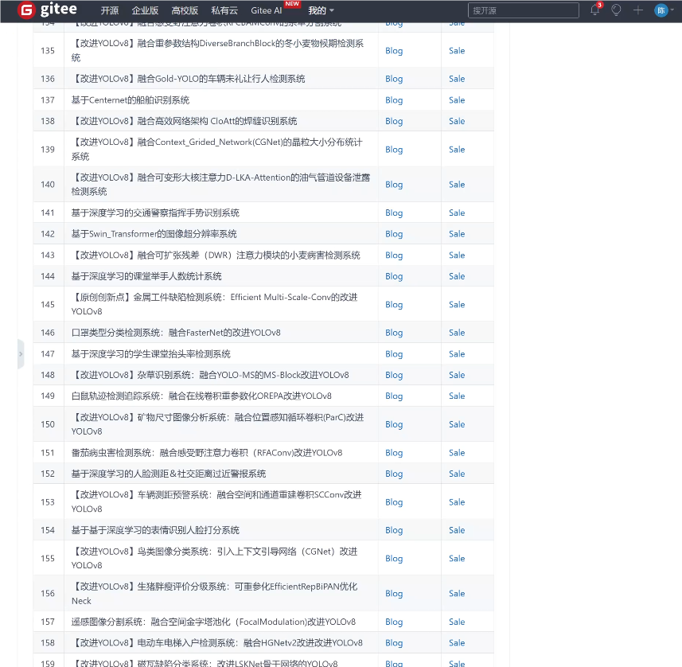

### 1.背景意义

研究背景与意义

在现代农业生产中，蛋类孵化的成功率直接影响到养殖业的经济效益和可持续发展。传统的孵化检测方法依赖于人工观察和经验判断，不仅耗时耗力，而且容易受到主观因素的影响，导致孵化效果的不稳定。因此，开发一种高效、准确的自动化检测系统显得尤为重要。近年来，随着计算机视觉和深度学习技术的迅猛发展，基于图像识别的孵化条件检测系统逐渐成为研究热点。

本研究旨在基于改进的YOLOv11模型，构建一个红外光谱蛋类孵化条件成熟与否的检测系统。该系统将利用红外图像数据，通过深度学习算法对蛋类的成熟状态进行实时监测与分析。我们使用的数据集包含247张图像，分为“fertile”（可孵化）和“infertile”（不可孵化）两类。这一数据集的构建为系统的训练和测试提供了基础，能够有效提升模型的识别准确率。

通过引入红外光谱技术，我们可以在不干扰孵化过程的情况下，获取蛋类内部的温度和湿度等信息，从而判断其成熟状态。这种非侵入式的检测方法不仅提高了检测的效率，还能降低对孵化环境的影响。此外，改进的YOLOv11模型在处理速度和准确性方面具有显著优势，能够实现实时监测，为养殖户提供及时的决策支持。

综上所述，本研究不仅具有重要的理论意义，还能为实际生产提供切实可行的解决方案，推动蛋类孵化技术的进步，提升养殖业的整体效益和可持续发展能力。

### 2.视频效果

[2.1 视频效果](https://www.bilibili.com/video/BV1sFBYYqE3i/)

### 3.图片效果


##### [项目涉及的源码数据来源链接](https://kdocs.cn/l/cszuIiCKVNis)**

注意：本项目提供训练的数据集和训练教程,由于版本持续更新,暂不提供权重文件（best.pt）,请按照6.训练教程进行训练后实现上图演示的效果。

### 4.数据集信息

##### 4.1 本项目数据集类别数＆类别名

nc: 2
names: ['fertile', 'infertile']


该项目为【目标检测】数据集，请在【训练教程和Web端加载模型教程（第三步）】这一步的时候按照【目标检测】部分的教程来训练

##### 4.2 本项目数据集信息介绍

本项目数据集信息介绍

本项目旨在开发一个改进的YOLOv11模型，以实现对红外光谱下蛋类孵化条件成熟与否的高效检测。为此，我们构建了一个专门的数据集，命名为“thermal_egg”，该数据集专注于分析和识别不同类型的蛋类孵化状态。数据集中包含两大类别：可孵化的“fertile”蛋和不可孵化的“infertile”蛋。这一分类的设定不仅反映了蛋类孵化过程中的生物学特征，也为模型的训练提供了明确的目标。

在数据集的构建过程中，我们采用了高精度的红外成像技术，以捕捉蛋类在不同孵化阶段的热特征。这些热特征能够有效地反映蛋内胚胎的发育状况，从而为模型提供了丰富的训练样本。数据集中包含了大量的红外图像，这些图像在不同的环境条件下采集，确保了数据的多样性和代表性。每一张图像都经过精心标注，确保模型在训练过程中能够准确学习到“fertile”和“infertile”这两类的特征。

此外，为了提高模型的泛化能力，我们还对数据集进行了数据增强处理，包括旋转、缩放和亮度调整等操作。这些处理不仅增加了样本的数量，也提高了模型在实际应用中的鲁棒性。通过这种方式，我们期望模型能够在不同的环境和条件下，依然保持高效的检测能力。

总之，数据集“thermal_egg”是本项目的核心组成部分，它为改进YOLOv11模型提供了坚实的基础。通过对蛋类孵化状态的准确检测，我们希望能够推动相关领域的研究进展，为农业生产和食品安全提供科学依据。


### 5.全套项目环境部署视频教程（零基础手把手教学）

[5.1 所需软件PyCharm和Anaconda安装教程（第一步）](https://www.bilibili.com/video/BV1BoC1YCEKi/?spm_id_from=333.999.0.0&vd_source=bc9aec86d164b67a7004b996143742dc)


[5.2 安装Python虚拟环境创建和依赖库安装视频教程（第二步）](https://www.bilibili.com/video/BV1ZoC1YCEBw?spm_id_from=333.788.videopod.sections&vd_source=bc9aec86d164b67a7004b996143742dc)

### 6.改进YOLOv11训练教程和Web_UI前端加载模型教程（零基础手把手教学）

[6.1 改进YOLOv11训练教程和Web_UI前端加载模型教程（第三步）](https://www.bilibili.com/video/BV1BoC1YCEhR?spm_id_from=333.788.videopod.sections&vd_source=bc9aec86d164b67a7004b996143742dc)


按照上面的训练视频教程链接加载项目提供的数据集，运行train.py即可开始训练



     Epoch   gpu_mem       box       obj       cls    labels  img_size
     1/200     20.8G   0.01576   0.01955  0.007536        22      1280: 100%|██████████| 849/849 [14:42<00:00,  1.04s/it]
               Class     Images     Labels          P          R     mAP@.5 mAP@.5:.95: 100%|██████████| 213/213 [01:14<00:00,  2.87it/s]
                 all       3395      17314      0.994      0.957      0.0957      0.0843

     Epoch   gpu_mem       box       obj       cls    labels  img_size
     2/200     20.8G   0.01578   0.01923  0.007006        22      1280: 100%|██████████| 849/849 [14:44<00:00,  1.04s/it]
               Class     Images     Labels          P          R     mAP@.5 mAP@.5:.95: 100%|██████████| 213/213 [01:12<00:00,  2.95it/s]
                 all       3395      17314      0.996      0.956      0.0957      0.0845

     Epoch   gpu_mem       box       obj       cls    labels  img_size
     3/200     20.8G   0.01561    0.0191  0.006895        27      1280: 100%|██████████| 849/849 [10:56<00:00,  1.29it/s]
               Class     Images     Labels          P          R     mAP@.5 mAP@.5:.95: 100%|███████   | 187/213 [00:52<00:00,  4.04it/s]
                 all       3395      17314      0.996      0.957      0.0957      0.0845


###### [项目数据集下载链接](https://kdocs.cn/l/cszuIiCKVNis)

### 7.原始YOLOv11算法讲解

##### YOLO11简介

> YOLO11源码地址：https://github.com/ultralytics/ultralytics

Ultralytics
YOLO11是一款尖端的、最先进的模型，它在之前YOLO版本成功的基础上进行了构建，并引入了新功能和改进，以进一步提升性能和灵活性。YOLO11设计快速、准确且易于使用，使其成为各种物体检测和跟踪、实例分割、图像分类以及姿态估计任务的绝佳选择。  


**YOLO11创新点如下:**

YOLO 11主要改进包括：  
`增强的特征提取`：YOLO 11采用了改进的骨干和颈部架构，增强了特征提取功能，以实现更精确的目标检测。  
`优化的效率和速度`：优化的架构设计和优化的训练管道提供更快的处理速度，同时保持准确性和性能之间的平衡。  
`更高的精度，更少的参数`：YOLO11m在COCO数据集上实现了更高的平均精度（mAP），参数比YOLOv8m少22%，使其在不影响精度的情况下提高了计算效率。  
`跨环境的适应性`：YOLO 11可以部署在各种环境中，包括边缘设备、云平台和支持NVIDIA GPU的系统。  
`广泛的支持任务`：YOLO 11支持各种计算机视觉任务，如对象检测、实例分割、图像分类、姿态估计和面向对象检测（OBB）。

**YOLO11不同模型尺寸信息：**

YOLO11 提供5种不同的型号规模模型，以满足不同的应用需求：

Model| size (pixels)| mAPval 50-95| Speed CPU ONNX (ms)| Speed T4 TensorRT10
(ms)| params (M)| FLOPs (B)  
---|---|---|---|---|---|---  
YOLO11n| 640| 39.5| 56.1 ± 0.8| 1.5 ± 0.0| 2.6| 6.5  
YOLO11s| 640| 47.0| 90.0 ± 1.2| 2.5 ± 0.0| 9.4| 21.5  
YOLO11m| 640| 51.5| 183.2 ± 2.0| 4.7 ± 0.1| 20.1| 68.0  
YOLO11l| 640| 53.4| 238.6 ± 1.4| 6.2 ± 0.1| 25.3| 86.9  
YOLO11x| 640| 54.7| 462.8 ± 6.7| 11.3 ± 0.2| 56.9| 194.9  
  
**模型常用训练超参数参数说明：**  
`YOLOv11
模型的训练设置包括训练过程中使用的各种超参数和配置`。这些设置会影响模型的性能、速度和准确性。关键的训练设置包括批量大小、学习率、动量和权重衰减。此外，优化器、损失函数和训练数据集组成的选择也会影响训练过程。对这些设置进行仔细的调整和实验对于优化性能至关重要。  
**以下是一些常用的模型训练参数和说明：**

参数名| 默认值| 说明  
---|---|---  
`model`| `None`| 指定用于训练的模型文件。接受指向 `.pt` 预训练模型或 `.yaml`
配置文件。对于定义模型结构或初始化权重至关重要。  
`data`| `None`| 数据集配置文件的路径（例如
`coco8.yaml`).该文件包含特定于数据集的参数，包括训练数据和验证数据的路径、类名和类数。  
`epochs`| `100`| 训练总轮数。每个epoch代表对整个数据集进行一次完整的训练。调整该值会影响训练时间和模型性能。  
`patience`| `100`| 在验证指标没有改善的情况下，提前停止训练所需的epoch数。当性能趋于平稳时停止训练，有助于防止过度拟合。  
`batch`| `16`| 批量大小，有三种模式:设置为整数(例如，’ Batch =16 ‘)， 60% GPU内存利用率的自动模式(’ Batch
=-1 ‘)，或指定利用率分数的自动模式(’ Batch =0.70 ')。  
`imgsz`| `640`| 用于训练的目标图像尺寸。所有图像在输入模型前都会被调整到这一尺寸。影响模型精度和计算复杂度。  
`device`| `None`| 指定用于训练的计算设备：单个 GPU (`device=0`）、多个 GPU (`device=0,1`)、CPU
(`device=cpu`)，或苹果芯片的 MPS (`device=mps`).  
`workers`| `8`| 加载数据的工作线程数（每 `RANK` 多 GPU 训练）。影响数据预处理和输入模型的速度，尤其适用于多 GPU 设置。  
`name`| `None`| 训练运行的名称。用于在项目文件夹内创建一个子目录，用于存储训练日志和输出结果。  
`pretrained`| `True`| 决定是否从预处理模型开始训练。可以是布尔值，也可以是加载权重的特定模型的字符串路径。提高训练效率和模型性能。  
`optimizer`| `'auto'`| 为训练模型选择优化器。选项包括 `SGD`, `Adam`, `AdamW`, `NAdam`,
`RAdam`, `RMSProp` 等，或 `auto` 用于根据模型配置进行自动选择。影响收敛速度和稳定性  
`lr0`| `0.01`| 初始学习率（即 `SGD=1E-2`, `Adam=1E-3`) .调整这个值对优化过程至关重要，会影响模型权重的更新速度。  
`lrf`| `0.01`| 最终学习率占初始学习率的百分比 = (`lr0 * lrf`)，与调度程序结合使用，随着时间的推移调整学习率。  


**各损失函数作用说明：**  
`定位损失box_loss`：预测框与标定框之间的误差（GIoU），越小定位得越准；  
`分类损失cls_loss`：计算锚框与对应的标定分类是否正确，越小分类得越准；  
`动态特征损失（dfl_loss）`：DFLLoss是一种用于回归预测框与目标框之间距离的损失函数。在计算损失时，目标框需要缩放到特征图尺度，即除以相应的stride，并与预测的边界框计算Ciou
Loss，同时与预测的anchors中心点到各边的距离计算回归DFLLoss。  


### 8.200+种全套改进YOLOV11创新点原理讲解

#### 8.1 200+种全套改进YOLOV11创新点原理讲解大全

由于篇幅限制，每个创新点的具体原理讲解就不全部展开，具体见下列网址中的改进模块对应项目的技术原理博客网址【Blog】（创新点均为模块化搭建，原理适配YOLOv5~YOLOv11等各种版本）

[改进模块技术原理博客【Blog】网址链接](https://gitee.com/qunmasj/good)



#### 8.2 精选部分改进YOLOV11创新点原理讲解

###### 这里节选部分改进创新点展开原理讲解(完整的改进原理见上图和[改进模块技术原理博客链接](https://gitee.com/qunmasj/good)【如果此小节的图加载失败可以通过CSDN或者Github搜索该博客的标题访问原始博客，原始博客图片显示正常】

### MS-Block简介
实时目标检测，以YOLO系列为例，已在工业领域中找到重要应用，特别是在边缘设备（如无人机和机器人）中。与之前的目标检测器不同，实时目标检测器旨在在速度和准确性之间追求最佳平衡。为了实现这一目标，提出了大量的工作：从第一代DarkNet到CSPNet，再到最近的扩展ELAN，随着性能的快速增长，实时目标检测器的架构经历了巨大的变化。

尽管性能令人印象深刻，但在不同尺度上识别对象仍然是实时目标检测器面临的基本挑战。这促使作者设计了一个强大的编码器架构，用于学习具有表现力的多尺度特征表示。具体而言，作者从两个新的角度考虑为实时目标检测编码多尺度特征：

从局部视角出发，作者设计了一个具有简单而有效的分层特征融合策略的MS-Block。受到Res2Net的启发，作者在MS-Block中引入了多个分支来进行特征提取，但不同的是，作者使用了一个带有深度卷积的 Inverted Bottleneck Block块，以实现对大Kernel的高效利用。

从全局视角出发，作者提出随着网络加深逐渐增加卷积的Kernel-Size。作者在浅层使用小Kernel卷积来更高效地处理高分辨率特征。另一方面，在深层中，作者采用大Kernel卷积来捕捉广泛的信息。

基于以上设计原则，作者呈现了作者的实时目标检测器，称为YOLO-MS。为了评估作者的YOLO-MS的性能，作者在MS COCO数据集上进行了全面的实验。还提供了与其他最先进方法的定量比较，以展示作者方法的强大性能。如图1所示，YOLO-MS在计算性能平衡方面优于其他近期的实时目标检测器。


具体而言，YOLO-MS-XS在MS COCO上获得了43%+的AP得分，仅具有450万个可学习参数和8.7亿个FLOPs。YOLO-MS-S和YOLO-MS分别获得了46%+和51%+的AP，可学习参数分别为810万和2220万。此外，作者的工作还可以作为其他YOLO模型的即插即用模块。通常情况下，作者的方法可以将YOLOv11的AP从37%+显著提高到40%+，甚至还可以使用更少的参数和FLOPs。

CSP Block是一个基于阶段级梯度路径的网络，平衡了梯度组合和计算成本。它是广泛应用于YOLO系列的基本构建块。已经提出了几种变体，包括YOLOv4和YOLOv11中的原始版本，Scaled YOLOv4中的CSPVoVNet，YOLOv11中的ELAN，以及RTMDet中提出的大Kernel单元。作者在图2(a)和图2(b)中分别展示了原始CSP块和ELAN的结构。


上述实时检测器中被忽视的一个关键方面是如何在基本构建块中编码多尺度特征。其中一个强大的设计原则是Res2Net，它聚合了来自不同层次的特征以增强多尺度表示。然而，这一原则并没有充分探索大Kernel卷积的作用，而大Kernel卷积已经在基于CNN的视觉识别任务模型中证明有效。将大Kernel卷积纳入Res2Net的主要障碍在于它们引入的计算开销，因为构建块采用了标准卷积。在作者的方法中，作者提出用 Inverted Bottleneck Block替代标准的3 × 3卷积，以享受大Kernel卷积的好处。

#### MS-Block

基于前面的分析，参考该博客提出了一个带有分层特征融合策略的全新Block，称为MS-Block，以增强实时目标检测器在提取多尺度特征时的能力，同时保持快速的推理速度。

MS-Block的具体结构如图2(c)所示。假设是输入特征。通过1×1卷积的转换后，X的通道维度增加到n*C。然后，作者将X分割成n个不同的组，表示为，其中。为了降低计算成本，作者选择n为3。

注意，除了之外，每个其他组都经过一个 Inverted Bottleneck Block层，用表示，其中k表示Kernel-Size，以获得。的数学表示如下：


根据这个公式，作者不将 Inverted Bottleneck Block层连接到，使其作为跨阶段连接，并保留来自前面层的信息。最后，作者将所有分割连接在一起，并应用1×1卷积来在所有分割之间进行交互，每个分割都编码不同尺度的特征。当网络加深时，这个1×1卷积也用于调整通道数。

#### Heterogeneous Kernel Selection Protocol
除了构建块的设计外，作者还从宏观角度探讨了卷积的使用。之前的实时目标检测器在不同的编码器阶段采用了同质卷积（即具有相同Kernel-Size的卷积），但作者认为这不是提取多尺度语义信息的最佳选项。

在金字塔结构中，从检测器的浅阶段提取的高分辨率特征通常用于捕捉细粒度语义，将用于检测小目标。相反，来自网络较深阶段的低分辨率特征用于捕捉高级语义，将用于检测大目标。如果作者在所有阶段都采用统一的小Kernel卷积，深阶段的有效感受野（ERF）将受到限制，影响大目标的性能。在每个阶段中引入大Kernel卷积可以帮助解决这个问题。然而，具有大的ERF的大Kernel可以编码更广泛的区域，这增加了在小目标外部包含噪声信息的概率，并且降低了推理速度。

在这项工作中，作者建议在不同阶段中采用异构卷积，以帮助捕获更丰富的多尺度特征。具体来说，在编码器的第一个阶段中，作者采用最小Kernel卷积，而最大Kernel卷积位于最后一个阶段。随后，作者逐步增加中间阶段的Kernel-Size，使其与特征分辨率的增加保持一致。这种策略允许提取细粒度和粗粒度的语义信息，增强了编码器的多尺度特征表示能力。

正如图所示，作者将k的值分别分配给编码器中的浅阶段到深阶段，取值为3、5、7和9。作者将其称为异构Kernel选择（HKS）协议。


作者的HKS协议能够在深层中扩大感受野，而不会对浅层产生任何其他影响。第4节的图4支持了作者的分析。此外，HKS不仅有助于编码更丰富的多尺度特征，还确保了高效的推理。

如表1所示，将大Kernel卷积应用于高分辨率特征会产生较高的计算开销。然而，作者的HKS协议在低分辨率特征上采用大Kernel卷积，从而与仅使用大Kernel卷积相比，大大降低了计算成本。


在实践中，作者经验性地发现，采用HKS协议的YOLO-MS的推理速度几乎与仅使用深度可分离的3 × 3卷积相同。


如图所示，作者模型的Backbone由4个阶段组成，每个阶段后面跟随1个步长为2的3 × 3卷积进行下采样。在第3个阶段后，作者添加了1个SPP块，与RTMDet中一样。在作者的编码器上，作者使用PAFPN作为Neck来构建特征金字塔[31, 35]。它融合了从Backbone不同阶段提取的多尺度特征。Neck中使用的基本构建块也是作者的MS-Block，在其中使用3 × 3深度可分离卷积进行快速推理。

此外，为了在速度和准确性之间取得更好的平衡，作者将Backbone中多级特征的通道深度减半。作者提供了3个不同尺度的YOLO-MS变体，即YOLO-MS-XS、YOLO-MS-S和YOLO-MS。不同尺度的YOLO-MS的详细配置列在表2中。对于YOLO-MS的其他部分，作者将其保持与RTMDet相同。


### 9.系统功能展示

图9.1.系统支持检测结果表格显示

  图9.2.系统支持置信度和IOU阈值手动调节

  图9.3.系统支持自定义加载权重文件best.pt(需要你通过步骤5中训练获得)

  图9.4.系统支持摄像头实时识别

  图9.5.系统支持图片识别

  图9.6.系统支持视频识别

  图9.7.系统支持识别结果文件自动保存

  图9.8.系统支持Excel导出检测结果数据


### 10. YOLOv11核心改进源码讲解

#### 10.1 shiftwise_conv.py

以下是经过精简和注释的核心代码部分，保留了最重要的功能，并对每个部分进行了详细的中文注释：

```python
import math
import torch
import torch.nn as nn
import torch.nn.functional as F

def get_conv2d(in_channels, out_channels, kernel_size, stride, padding, dilation, groups, bias):
    # 创建一个二维卷积层
    return nn.Conv2d(
        in_channels, out_channels, kernel_size, stride, padding, dilation, groups, bias
    )

def get_bn(channels):
    # 创建一个批归一化层
    return nn.BatchNorm2d(channels)

class Mask(nn.Module):
    def __init__(self, size):
        super().__init__()
        # 初始化权重参数，范围在[-1, 1]之间
        self.weight = torch.nn.Parameter(data=torch.Tensor(*size), requires_grad=True)
        self.weight.data.uniform_(-1, 1)

    def forward(self, x):
        # 应用掩码，返回经过sigmoid激活后的权重与输入的乘积
        w = torch.sigmoid(self.weight)
        masked_wt = w.mul(x)
        return masked_wt

class LoRAConvsByWeight(nn.Module):
    def __init__(self, in_channels, out_channels, big_kernel, small_kernel, stride=1, group=1, bn=True, use_small_conv=True):
        super().__init__()
        self.kernels = (small_kernel, big_kernel)
        self.stride = stride
        self.small_conv = use_small_conv
        padding, after_padding_index, index = self.shift(self.kernels)
        self.pad = padding, after_padding_index, index
        self.nk = math.ceil(big_kernel / small_kernel)
        out_n = out_channels * self.nk
        
        # 使用小卷积进行特征提取
        self.split_convs = nn.Conv2d(in_channels, out_n, kernel_size=small_kernel, stride=stride, padding=padding, groups=group, bias=False)
        self.lora1 = Mask((1, out_n, 1, 1))
        self.lora2 = Mask((1, out_n, 1, 1))
        self.use_bn = bn
        if bn:
            self.bn_lora1 = get_bn(out_channels)
            self.bn_lora2 = get_bn(out_channels)

    def forward(self, inputs):
        out = self.split_convs(inputs)
        *_, ori_h, ori_w = inputs.shape
        lora1_x = self.forward_lora(self.lora1(out), ori_h, ori_w, VH='H', bn=self.bn_lora1)
        lora2_x = self.forward_lora(self.lora2(out), ori_h, ori_w, VH='W', bn=self.bn_lora2)
        return lora1_x + lora2_x

    def forward_lora(self, out, ori_h, ori_w, VH='H', bn=None):
        # 将输出沿着每个组的索引进行分割
        b, c, h, w = out.shape
        out = torch.split(out.reshape(b, -1, self.nk, h, w), 1, 2)
        x = 0
        for i in range(self.nk):
            outi = self.rearrange_data(out[i], i, ori_h, ori_w, VH)
            x = x + outi
        if self.use_bn:
            x = bn(x)
        return x

    def rearrange_data(self, x, idx, ori_h, ori_w, VH):
        # 根据索引调整数据
        padding, _, index = self.pad
        x = x.squeeze(2)
        *_, h, w = x.shape
        k = min(self.kernels)
        ori_k = max(self.kernels)
        ori_p = ori_k // 2
        stride = self.stride
        
        # 计算填充和切片的起始点
        if (idx + 1) >= index:
            pad_l = 0
            s = (idx + 1 - index) * (k // stride)
        else:
            pad_l = (index - 1 - idx) * (k // stride)
            s = 0
        
        if VH == 'H':
            suppose_len = (ori_w + 2 * ori_p - ori_k) // stride + 1
            pad_r = 0 if (s + suppose_len) <= (w + pad_l) else s + suppose_len - w - pad_l
            new_pad = (pad_l, pad_r, 0, 0)
            dim = 3
        else:
            suppose_len = (ori_h + 2 * ori_p - ori_k) // stride + 1
            pad_r = 0 if (s + suppose_len) <= (h + pad_l) else s + suppose_len - h - pad_l
            new_pad = (0, 0, pad_l, pad_r)
            dim = 2
        
        if len(set(new_pad)) > 1:
            x = F.pad(x, new_pad)

        xs = torch.narrow(x, dim, s, suppose_len)
        return xs

    def shift(self, kernels):
        # 计算填充和索引
        mink, maxk = min(kernels), max(kernels)
        mid_p = maxk // 2
        offset_idx_left = mid_p % mink
        offset_idx_right = (math.ceil(maxk / mink) * mink - mid_p - 1) % mink
        padding = offset_idx_left % mink
        while padding < offset_idx_right:
            padding += mink
        while padding < (mink - 1):
            padding += mink
        after_padding_index = padding - offset_idx_left
        index = math.ceil((mid_p + 1) / mink)
        real_start_idx = index - after_padding_index // mink
        return padding, after_padding_index, real_start_idx

class ReparamLargeKernelConv(nn.Module):
    def __init__(self, in_channels, out_channels, kernel_size, small_kernel=5, stride=1, groups=1, small_kernel_merged=False, Decom=True, bn=True):
        super(ReparamLargeKernelConv, self).__init__()
        self.kernel_size = kernel_size
        self.small_kernel = small_kernel
        self.Decom = Decom
        padding = kernel_size // 2
        
        if small_kernel_merged:
            self.lkb_reparam = get_conv2d(in_channels, out_channels, kernel_size, stride, padding, 1, groups, True)
        else:
            if self.Decom:
                self.LoRA = LoRAConvsByWeight(in_channels, out_channels, kernel_size, small_kernel, stride, groups, bn)
            else:
                self.lkb_origin = get_conv2d(in_channels, out_channels, kernel_size, stride, padding, 1, groups, bn)
            if (small_kernel is not None) and small_kernel < kernel_size:
                self.small_conv = get_conv2d(in_channels, out_channels, small_kernel, stride, small_kernel // 2, 1, groups, bn)
        
        self.bn = get_bn(out_channels)
        self.act = nn.SiLU()

    def forward(self, inputs):
        if hasattr(self, "lkb_reparam"):
            out = self.lkb_reparam(inputs)
        elif self.Decom:
            out = self.LoRA(inputs)
            if hasattr(self, "small_conv"):
                out += self.small_conv(inputs)
        else:
            out = self.lkb_origin(inputs)
            if hasattr(self, "small_conv"):
                out += self.small_conv(inputs)
        return self.act(self.bn(out))

    def get_equivalent_kernel_bias(self):
        # 获取等效的卷积核和偏置
        eq_k, eq_b = fuse_bn(self.lkb_origin, self.bn)
        if hasattr(self, "small_conv"):
            small_k, small_b = fuse_bn(self.small_conv, self.bn)
            eq_b += small_b
            eq_k += nn.functional.pad(small_k, [(self.kernel_size - self.small_kernel) // 2] * 4)
        return eq_k, eq_b

    def switch_to_deploy(self):
        # 切换到部署模式
        if hasattr(self, 'lkb_origin'):
            eq_k, eq_b = self.get_equivalent_kernel_bias()
            self.lkb_reparam = get_conv2d(self.lkb_origin.in_channels, self.lkb_origin.out_channels, self.lkb_origin.kernel_size, self.lkb_origin.stride, self.lkb_origin.padding, self.lkb_origin.dilation, self.lkb_origin.groups, True)
            self.lkb_reparam.weight.data = eq_k
            self.lkb_reparam.bias.data = eq_b
            self.__delattr__("lkb_origin")
            if hasattr(self, "small_conv"):
                self.__delattr__("small_conv")
```

### 代码说明：
1. **卷积和批归一化的创建**：`get_conv2d` 和 `get_bn` 函数用于创建卷积层和批归一化层。
2. **掩码类**：`Mask` 类用于创建可学习的掩码，控制特征的选择。
3. **LoRA卷积**：`LoRAConvsByWeight` 类实现了基于权重的LoRA卷积，支持多尺度卷积操作。
4. **重参数化卷积**：`ReparamLargeKernelConv` 类实现了重参数化卷积，支持大卷积核和小卷积核的组合，提供了前向传播和部署模式切换的功能。

以上代码保留了原始代码的核心功能，并进行了必要的简化和注释，便于理解和使用。

这个文件 `shiftwise_conv.py` 定义了一个用于深度学习中卷积操作的模块，特别是针对大卷积核的重参数化卷积。以下是对代码的逐步分析和说明。

首先，文件导入了必要的库，包括 `math`、`torch` 及其子模块 `torch.nn` 和 `torch.nn.functional`。这些库为后续的神经网络构建和操作提供了基础。

接下来，定义了一个 `get_conv2d` 函数，用于创建一个二维卷积层。这个函数接收多个参数，包括输入通道数、输出通道数、卷积核大小、步幅、填充、扩张、分组和是否使用偏置。函数内部计算了填充值，并返回一个 `nn.Conv2d` 对象。

然后是 `get_bn` 函数，它用于创建一个批归一化层，接收通道数作为参数。

接下来定义了一个 `Mask` 类，继承自 `nn.Module`。这个类的构造函数初始化了一个可训练的权重参数，并在前向传播中通过 sigmoid 函数对权重进行处理，生成一个掩码并与输入相乘。

`conv_bn_ori` 函数则用于创建一个包含卷积层和可选的批归一化层的序列。它首先计算填充值，然后创建卷积层并根据需要添加批归一化层。

`LoRAConvsByWeight` 类实现了一种特殊的卷积结构，结合了两个不同大小的卷积核。构造函数中，初始化了多个卷积层和掩码，并在前向传播中将输入通过这些卷积层处理。该类的设计目的是通过权重的组合来实现通道的重排。

`conv_bn` 函数根据输入的卷积核大小选择使用 `conv_bn_ori` 或 `LoRAConvsByWeight` 进行卷积操作。

`fuse_bn` 函数用于将卷积层和批归一化层融合，计算出等效的卷积核和偏置，以便在推理阶段减少计算量。

`ReparamLargeKernelConv` 类是该文件的核心部分，提供了一个重参数化的大卷积核卷积层。构造函数中，根据输入参数初始化了多个卷积层，并根据需要选择是否合并小卷积核。前向传播中，根据不同的条件计算输出，并通过激活函数和批归一化层进行处理。

该类还包含了 `get_equivalent_kernel_bias` 方法，用于获取等效的卷积核和偏置，以及 `switch_to_deploy` 方法，用于在推理阶段切换到重参数化的卷积层，提升推理效率。

总体而言，这个文件实现了一种灵活的卷积结构，支持大卷积核的重参数化和小卷积核的组合，适用于需要高效卷积操作的深度学习模型。

#### 10.2 block.py

以下是经过简化和注释的核心代码部分，主要保留了关键的类和函数，同时对每个部分进行了详细的中文注释。

```python
import torch
import torch.nn as nn
import torch.nn.functional as F

def autopad(k, p=None, d=1):
    """自动填充以保持输出形状与输入相同。"""
    if d > 1:
        k = d * (k - 1) + 1 if isinstance(k, int) else [d * (x - 1) + 1 for x in k]  # 实际的卷积核大小
    if p is None:
        p = k // 2 if isinstance(k, int) else [x // 2 for x in k]  # 自动填充
    return p

class Conv(nn.Module):
    """自定义卷积层，包含卷积和批归一化。"""
    def __init__(self, in_channels, out_channels, kernel_size=3, stride=1, padding=None, groups=1, act=True):
        super().__init__()
        self.conv = nn.Conv2d(in_channels, out_channels, kernel_size, stride, autopad(kernel_size, padding), groups=groups, bias=False)
        self.bn = nn.BatchNorm2d(out_channels)
        self.act = nn.SiLU() if act else nn.Identity()  # 使用SiLU激活函数

    def forward(self, x):
        return self.act(self.bn(self.conv(x)))  # 前向传播

class Bottleneck(nn.Module):
    """标准瓶颈结构，包含两个卷积层。"""
    def __init__(self, c1, c2, shortcut=True, g=1, k=(3, 3), e=0.5):
        super().__init__()
        c_ = int(c2 * e)  # 隐藏通道数
        self.cv1 = Conv(c1, c_, k[0], 1)  # 第一个卷积
        self.cv2 = Conv(c_, c2, k[1], 1)  # 第二个卷积
        self.add = shortcut and c1 == c2  # 是否使用shortcut连接

    def forward(self, x):
        return x + self.cv2(self.cv1(x)) if self.add else self.cv2(self.cv1(x))  # 前向传播

class C3(nn.Module):
    """C3模块，包含多个瓶颈结构。"""
    def __init__(self, c1, c2, n=1, shortcut=False, g=1, e=0.5, k=3):
        super().__init__()
        self.m = nn.Sequential(*(Bottleneck(c1, c2, shortcut, g, k=(k, k), e=e) for _ in range(n)))  # 多个瓶颈结构

    def forward(self, x):
        return self.m(x)  # 前向传播

class C3k2(nn.Module):
    """C3k2模块，包含多个C3模块。"""
    def __init__(self, c1, c2, n=1, c3k=False, e=0.5, g=1, shortcut=True):
        super().__init__()
        self.m = nn.ModuleList(C3(c1, c2, n, shortcut, g, e) for _ in range(n))  # 多个C3模块

    def forward(self, x):
        for layer in self.m:
            x = layer(x)  # 前向传播
        return x

class DynamicConv(nn.Module):
    """动态卷积层，包含条件卷积。"""
    def __init__(self, c1, c2, k=1, s=1, p=None, g=1, d=1, act=True, num_experts=4):
        super().__init__()
        self.conv = nn.Sequential(
            DynamicConv_Single(c1, c2, kernel_size=k, stride=s, padding=autopad(k, p, d), dilation=d, groups=g, num_experts=num_experts),
            nn.BatchNorm2d(c2),
            nn.SiLU() if act else nn.Identity()
        )

    def forward(self, x):
        return self.conv(x)  # 前向传播

class C3k_DynamicConv(C3k):
    """包含动态卷积的C3模块。"""
    def __init__(self, c1, c2, n=1, shortcut=False, g=1, e=0.5, k=3):
        super().__init__(c1, c2, n, shortcut, g, e, k)
        c_ = int(c2 * e)  # 隐藏通道数
        self.m = nn.Sequential(*(Bottleneck_DynamicConv(c_, c_, shortcut, g, k=(k, k), e=1.0) for _ in range(n)))  # 多个动态卷积瓶颈

    def forward(self, x):
        return self.m(x)  # 前向传播

# 其余部分代码略去，以上是核心部分的示例。
```

以上代码保留了主要的结构和功能，同时添加了详细的中文注释，便于理解每个部分的作用和实现方式。

这个程序文件 `block.py` 是一个用于构建深度学习模型的模块，主要是针对图像处理任务，尤其是目标检测和图像分割等应用。文件中包含了多种神经网络模块和操作，包括卷积层、注意力机制、残差连接等。以下是对文件中主要部分的说明：

首先，文件导入了必要的库，包括 PyTorch、NumPy 和一些自定义模块。这些模块提供了构建神经网络所需的基础组件。

接下来，定义了一些通用的函数和类，例如 `autopad` 用于自动计算卷积层的填充，`make_divisible` 用于确保通道数可被特定值整除。

然后，文件中定义了多个网络模块，以下是一些关键模块的说明：

1. **DyHeadBlock 和 DyHeadBlockWithDCNV3**：这些模块实现了动态头部结构，结合了变形卷积（DCN）和多种注意力机制，适用于处理不同尺度的特征图。

2. **Fusion 和 BIFPN**：这些模块用于特征融合，BIFPN（Bi-directional Feature Pyramid Network）是一种双向特征金字塔网络，能够有效地融合来自不同层次的特征。

3. **C3k 和 C3k2**：这些是基础的卷积块，包含了多个卷积层和激活函数，支持不同的结构配置。

4. **DynamicConv 和 GhostConv**：这些模块实现了动态卷积和幽灵卷积，旨在提高模型的效率和性能。

5. **注意力机制**：如 `ChannelAttention_HSFPN` 和 `SMA`，这些模块用于增强特征图的表达能力，通过计算通道和空间注意力来提升特征的选择性。

6. **PyramidPoolAgg 和其他聚合模块**：这些模块实现了金字塔池化和其他特征聚合策略，能够有效地整合多尺度特征。

7. **iRMB 和 MogaBlock**：这些模块结合了不同的卷积和注意力机制，旨在通过多层次的特征提取和融合来提升模型的性能。

8. **各类瓶颈模块**：如 `Bottleneck`, `Bottleneck_FADC`, `Bottleneck_AKConv` 等，都是用于构建更复杂网络结构的基础单元，通常包含卷积、激活和归一化操作。

9. **上采样和下采样模块**：如 `V7DownSampling` 和 `CARAFE`，用于调整特征图的尺寸，以适应不同的网络结构需求。

文件的最后部分包含了一些新的网络结构和模块，旨在提升模型的性能和效率，适应不同的应用场景。

总的来说，`block.py` 文件提供了一个灵活的框架，允许用户根据需要组合和构建复杂的神经网络结构，适用于各种计算机视觉任务。

#### 10.3 transformer.py

以下是经过简化和注释的核心代码部分：

```python
import torch
import torch.nn as nn
from functools import partial

# 定义线性归一化和RepBN的组合
ln = nn.LayerNorm
linearnorm = partial(LinearNorm, norm1=ln, norm2=RepBN, step=60000)

class TransformerEncoderLayer_RepBN(nn.Module):
    def __init__(self, c1, cm=2048, num_heads=8, dropout=0, act=..., normalize_before=False):
        super().__init__()
        # 初始化层归一化
        self.norm1 = linearnorm(c1)
        self.norm2 = linearnorm(c1)

class AIFI_RepBN(TransformerEncoderLayer_RepBN):
    """定义AIFI变换器层。"""

    def __init__(self, c1, cm=2048, num_heads=8, dropout=0, act=nn.GELU(), normalize_before=False):
        """使用指定参数初始化AIFI实例。"""
        super().__init__(c1, cm, num_heads, dropout, act, normalize_before)

    def forward(self, x):
        """AIFI变换器层的前向传播。"""
        c, h, w = x.shape[1:]  # 获取输入的通道数、高度和宽度
        pos_embed = self.build_2d_sincos_position_embedding(w, h, c)  # 构建位置嵌入
        # 将输入从形状[B, C, H, W]展平为[B, HxW, C]
        x = super().forward(x.flatten(2).permute(0, 2, 1), pos=pos_embed.to(device=x.device, dtype=x.dtype))
        # 将输出转换回形状[B, C, H, W]
        return x.permute(0, 2, 1).view([-1, c, h, w]).contiguous()

    @staticmethod
    def build_2d_sincos_position_embedding(w, h, embed_dim=256, temperature=10000.0):
        """构建2D正弦-余弦位置嵌入。"""
        assert embed_dim % 4 == 0, "嵌入维度必须是4的倍数"
        grid_w = torch.arange(w, dtype=torch.float32)  # 水平方向的网格
        grid_h = torch.arange(h, dtype=torch.float32)  # 垂直方向的网格
        grid_w, grid_h = torch.meshgrid(grid_w, grid_h, indexing="ij")  # 创建网格
        pos_dim = embed_dim // 4  # 计算位置维度
        omega = torch.arange(pos_dim, dtype=torch.float32) / pos_dim
        omega = 1.0 / (temperature**omega)  # 计算频率

        # 计算位置嵌入
        out_w = grid_w.flatten()[..., None] @ omega[None]
        out_h = grid_h.flatten()[..., None] @ omega[None]

        # 返回正弦和余弦位置嵌入
        return torch.cat([torch.sin(out_w), torch.cos(out_w), torch.sin(out_h), torch.cos(out_h)], 1)[None]
```

### 代码说明：
1. **线性归一化和RepBN的组合**：使用`partial`函数将`LinearNorm`与`LayerNorm`和`RepBN`结合，方便后续使用。
2. **TransformerEncoderLayer_RepBN类**：这是一个基础的变换器编码层，初始化时设置了两个归一化层。
3. **AIFI_RepBN类**：继承自`TransformerEncoderLayer_RepBN`，定义了AIFI变换器层。
   - `__init__`方法用于初始化层的参数。
   - `forward`方法实现了前向传播，首先构建位置嵌入，然后将输入展平并传递给父类的前向方法，最后将输出转换回原始形状。
4. **build_2d_sincos_position_embedding方法**：静态方法用于生成2D正弦-余弦位置嵌入，确保嵌入维度是4的倍数，计算网格位置并返回合并后的正弦和余弦值。

这个程序文件 `transformer.py` 定义了一个基于 Transformer 架构的模型，主要包含了一个特殊的 Transformer 编码器层 `AIFI_RepBN`，它结合了线性归一化和重参数化批归一化（RepBN）。文件中使用了 PyTorch 库来构建深度学习模型。

首先，文件导入了必要的库，包括 PyTorch 的核心模块和一些自定义的模块。`RepBN` 和 `LinearNorm` 是自定义的归一化层，`TransformerEncoderLayer` 是一个标准的 Transformer 编码器层，`AIFI` 可能是另一个自定义模块。

接下来，定义了一个名为 `TransformerEncoderLayer_RepBN` 的类，它继承自 `TransformerEncoderLayer`。在初始化方法中，调用了父类的构造函数，并定义了两个归一化层 `norm1` 和 `norm2`，这两个层使用了之前定义的 `linearnorm` 函数，这个函数是一个部分应用的函数，结合了层归一化和重参数化批归一化。

然后，定义了 `AIFI_RepBN` 类，它继承自 `TransformerEncoderLayer_RepBN`，并且在初始化时调用了父类的构造函数。这个类的 `forward` 方法实现了前向传播的逻辑。输入 `x` 的形状为 `[B, C, H, W]`，表示批量大小、通道数、高度和宽度。首先，通过调用 `build_2d_sincos_position_embedding` 方法生成二维的正弦余弦位置嵌入，然后将输入数据展平并重新排列为适合 Transformer 的格式，最后调用父类的 `forward` 方法进行计算，并将输出结果恢复为原始的形状。

`build_2d_sincos_position_embedding` 是一个静态方法，用于生成二维的正弦余弦位置嵌入。它接受宽度 `w`、高度 `h` 和嵌入维度 `embed_dim` 作为参数。方法中首先检查嵌入维度是否可以被 4 整除，然后创建网格坐标，计算正弦和余弦值，并将它们拼接成最终的嵌入。

总体而言，这个文件实现了一个带有特殊归一化层的 Transformer 编码器，能够处理二维输入数据，并生成相应的位置信息，以便在后续的深度学习任务中使用。

#### 10.4 rep_block.py

以下是经过简化和注释的核心代码部分，保留了最重要的功能和结构。

```python
import torch
import torch.nn as nn
import torch.nn.functional as F

# 定义一个用于融合卷积和批归一化的函数
def transI_fusebn(kernel, bn):
    # 从批归一化层中提取参数
    gamma = bn.weight  # 缩放因子
    std = (bn.running_var + bn.eps).sqrt()  # 标准差
    # 返回融合后的卷积核和偏置
    return kernel * ((gamma / std).reshape(-1, 1, 1, 1)), bn.bias - bn.running_mean * gamma / std

# 定义一个卷积和批归一化的组合层
def conv_bn(in_channels, out_channels, kernel_size, stride=1, padding=0, dilation=1, groups=1):
    # 创建卷积层
    conv_layer = nn.Conv2d(in_channels=in_channels, out_channels=out_channels, kernel_size=kernel_size,
                           stride=stride, padding=padding, dilation=dilation, groups=groups,
                           bias=False)
    # 创建批归一化层
    bn_layer = nn.BatchNorm2d(num_features=out_channels, affine=True)
    # 将卷积层和批归一化层组合成一个顺序容器
    return nn.Sequential(conv_layer, bn_layer)

# 定义一个多分支块
class DiverseBranchBlock(nn.Module):
    def __init__(self, in_channels, out_channels, kernel_size, stride=1, padding=None, dilation=1, groups=1):
        super(DiverseBranchBlock, self).__init__()
        
        # 如果没有提供padding，则自动计算
        if padding is None:
            padding = kernel_size // 2
        
        # 定义原始卷积和批归一化组合
        self.dbb_origin = conv_bn(in_channels=in_channels, out_channels=out_channels, kernel_size=kernel_size,
                                  stride=stride, padding=padding, dilation=dilation, groups=groups)

        # 定义平均池化和批归一化组合
        self.dbb_avg = nn.Sequential(
            nn.Conv2d(in_channels=in_channels, out_channels=out_channels, kernel_size=1, stride=1, padding=0, groups=groups, bias=False),
            nn.BatchNorm2d(out_channels),
            nn.AvgPool2d(kernel_size=kernel_size, stride=stride, padding=0)
        )

    def forward(self, inputs):
        # 前向传播
        out = self.dbb_origin(inputs)  # 通过原始卷积块
        out += self.dbb_avg(inputs)     # 加上平均池化结果
        return out  # 返回最终输出

# 测试代码
if __name__ == "__main__":
    # 创建一个多分支块实例
    dbb = DiverseBranchBlock(in_channels=3, out_channels=16, kernel_size=3)
    # 创建一个随机输入张量
    input_tensor = torch.randn(1, 3, 64, 64)  # batch_size=1, channels=3, height=64, width=64
    # 前向传播
    output = dbb(input_tensor)
    print(output.shape)  # 输出形状
```

### 代码说明：
1. **transI_fusebn**: 该函数用于将卷积层和批归一化层的参数融合，返回融合后的卷积核和偏置。
2. **conv_bn**: 该函数创建一个包含卷积层和批归一化层的顺序容器，便于在神经网络中使用。
3. **DiverseBranchBlock**: 这是一个多分支块的实现，包含原始卷积和平均池化分支。`forward`方法实现了前向传播逻辑。
4. **测试代码**: 在主程序中创建了一个`DiverseBranchBlock`实例，并通过随机输入进行测试，输出结果的形状。

这个简化版本保留了多分支块的核心功能，并提供了必要的注释以帮助理解代码的工作原理。

这个文件 `rep_block.py` 定义了一些用于深度学习的模块，主要是与卷积操作和批归一化（Batch Normalization）相关的类和函数。这些模块的设计旨在实现多样化的分支结构，以便在神经网络中提高特征提取的能力。

首先，文件导入了必要的库，包括 PyTorch 的核心库和一些功能模块。接着，定义了一些用于卷积和批归一化的转换函数，例如 `transI_fusebn` 用于将卷积核和批归一化的参数融合，`transII_addbranch` 用于将多个卷积核和偏置相加，`transIII_1x1_kxk` 用于处理不同卷积核之间的组合，等等。这些函数为后续的模块提供了基础的操作。

接下来，定义了几个主要的类，包括 `DiverseBranchBlock`、`WideDiverseBranchBlock` 和 `DeepDiverseBranchBlock`。这些类的构造函数中，首先会根据输入参数初始化卷积层和批归一化层，并根据需要设置不同的分支结构。每个类都实现了 `forward` 方法，定义了前向传播的计算过程，结合了多个卷积分支的输出。

`DiverseBranchBlock` 类实现了一个多样化的分支结构，可以根据输入的通道数和卷积核大小灵活配置。它的 `get_equivalent_kernel_bias` 方法用于计算等效的卷积核和偏置，以便在部署时简化模型结构。

`WideDiverseBranchBlock` 类在 `DiverseBranchBlock` 的基础上，增加了对宽卷积的支持，能够同时处理水平和垂直方向的卷积，进一步增强了特征提取的能力。

`DeepDiverseBranchBlock` 类则通过嵌套使用其他分支模块，构建了一个更深层次的结构，能够捕捉更复杂的特征。

此外，文件中还定义了一些辅助类，如 `IdentityBasedConv1x1` 和 `BNAndPadLayer`，用于实现特定的卷积操作和批归一化处理。`IdentityBasedConv1x1` 类实现了带有身份映射的 1x1 卷积，而 `BNAndPadLayer` 则在批归一化的基础上添加了填充操作。

最后，文件中的每个模块都提供了初始化方法，允许用户自定义权重初始化的方式，以便在训练过程中获得更好的性能。

总体来说，这个文件实现了一些复杂的卷积结构，适用于需要高效特征提取的深度学习任务，特别是在计算机视觉领域。

### 11.完整训练+Web前端界面+200+种全套创新点源码、数据集获取


# [下载链接：https://mbd.pub/o/bread/Z5ibmZxp](https://mbd.pub/o/bread/Z5ibmZxp)